# FFTM Benchmark Figures: Single-Node A100 Run With Warmup

This report summarizes the generated benchmark figures and tables for the single-node A100 dataset after adding active benchmark warmup rounds. It uses the same raw-log analysis pipeline as `A100_single_node`.

## Dataset

- Source data: `build/resutls_stats/A100_single_node_warmup`
- Comparison baseline: `build/resutls_stats/A100_single_node`
- Generated figures: `25`
- Generated tables: `7`
- Warmup comparison: [`warmup_comparison/README.md`](warmup_comparison/README.md)

## Figures

### 3d fftm ffts absolute relative runtime

[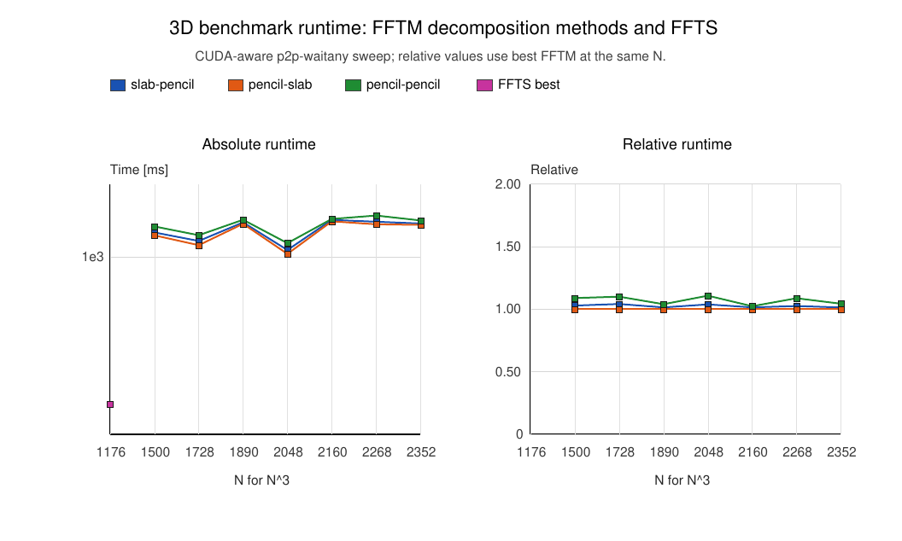](figures/fig_3d_fftm_ffts_absolute_relative_runtime.pdf)

PDF: [`figures/fig_3d_fftm_ffts_absolute_relative_runtime.pdf`](figures/fig_3d_fftm_ffts_absolute_relative_runtime.pdf)

### 4d fftm ffts absolute relative runtime

[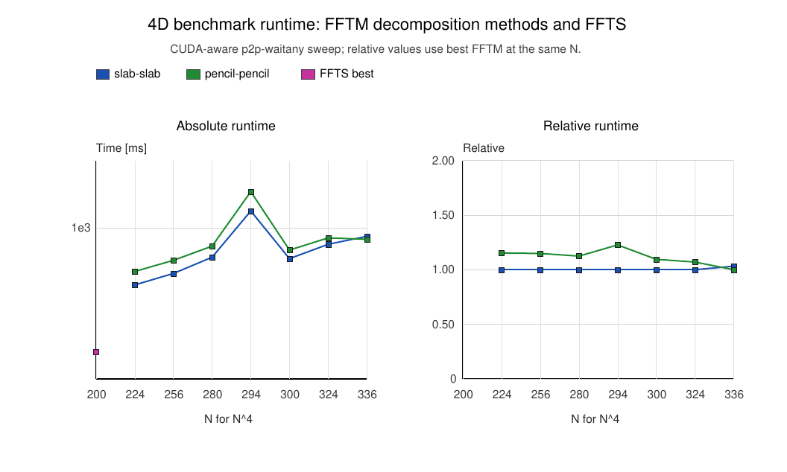](figures/fig_4d_fftm_ffts_absolute_relative_runtime.pdf)

PDF: [`figures/fig_4d_fftm_ffts_absolute_relative_runtime.pdf`](figures/fig_4d_fftm_ffts_absolute_relative_runtime.pdf)

### fftm 3d gpu scaling

[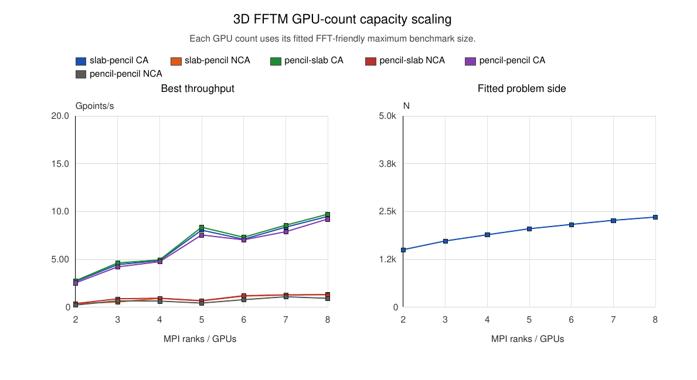](figures/fig_fftm_3d_gpu_scaling.pdf)

PDF: [`figures/fig_fftm_3d_gpu_scaling.pdf`](figures/fig_fftm_3d_gpu_scaling.pdf)

### fftm 4d gpu scaling

[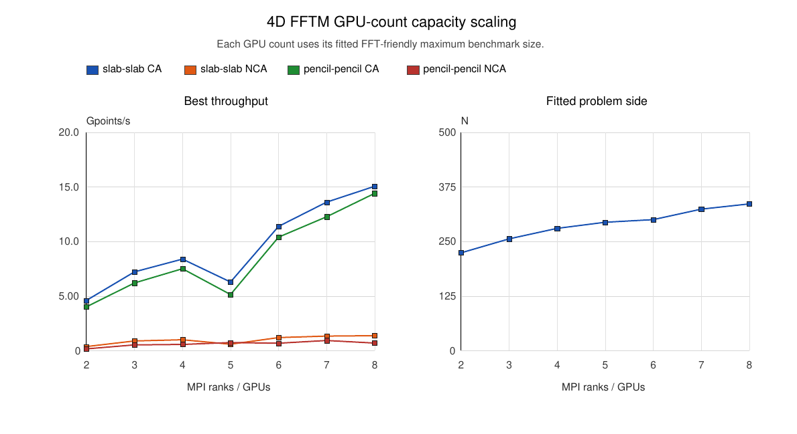](figures/fig_fftm_4d_gpu_scaling.pdf)

PDF: [`figures/fig_fftm_4d_gpu_scaling.pdf`](figures/fig_fftm_4d_gpu_scaling.pdf)

### fftm 3d effective gflops gpu scaling

[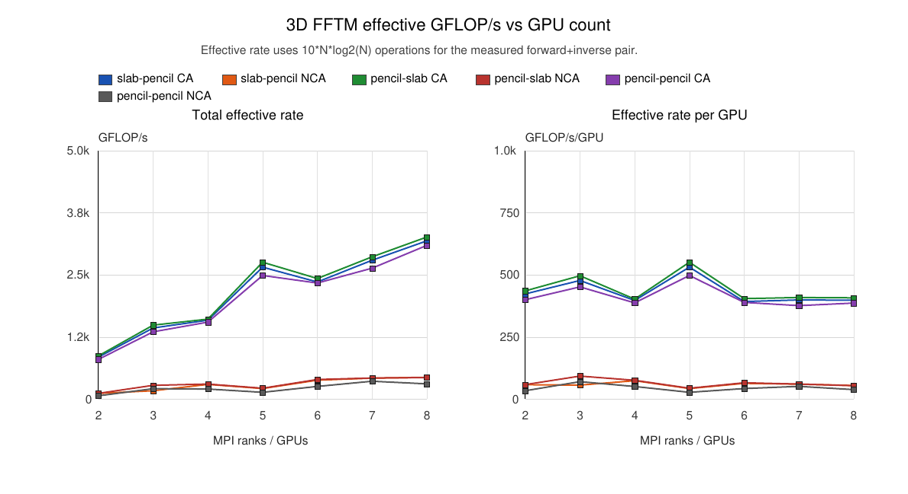](figures/fig_fftm_3d_effective_gflops_gpu_scaling.pdf)

PDF: [`figures/fig_fftm_3d_effective_gflops_gpu_scaling.pdf`](figures/fig_fftm_3d_effective_gflops_gpu_scaling.pdf)

### fftm 4d effective gflops gpu scaling

[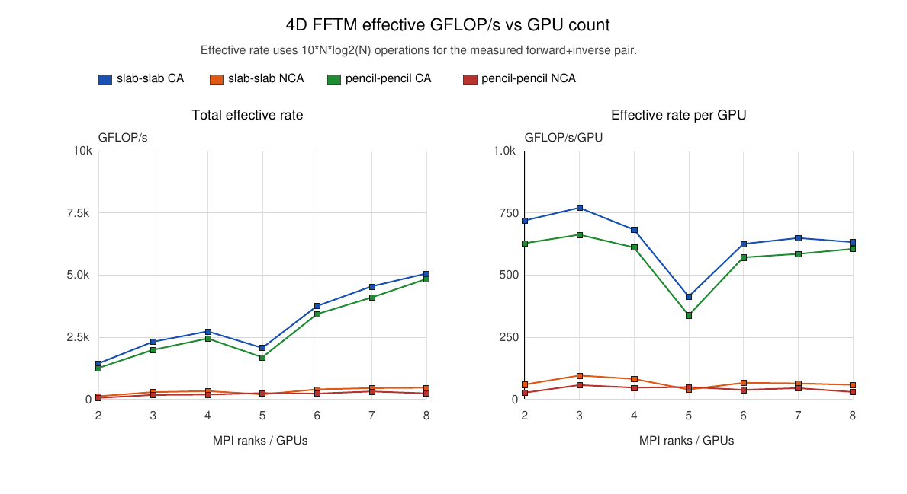](figures/fig_fftm_4d_effective_gflops_gpu_scaling.pdf)

PDF: [`figures/fig_fftm_4d_effective_gflops_gpu_scaling.pdf`](figures/fig_fftm_4d_effective_gflops_gpu_scaling.pdf)

### fftm 3d best throughput

[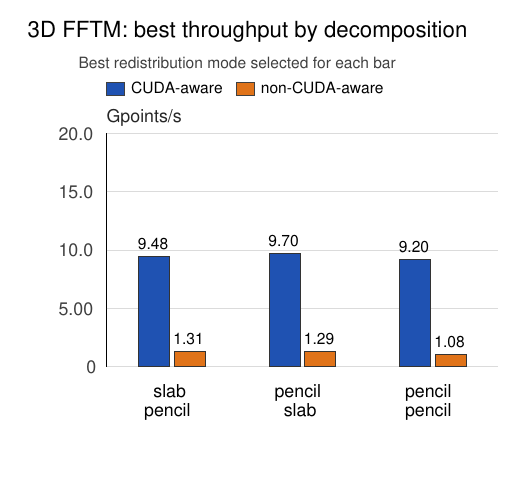](figures/fig_fftm_3d_best_throughput.pdf)

PDF: [`figures/fig_fftm_3d_best_throughput.pdf`](figures/fig_fftm_3d_best_throughput.pdf)

### fftm 4d best throughput

[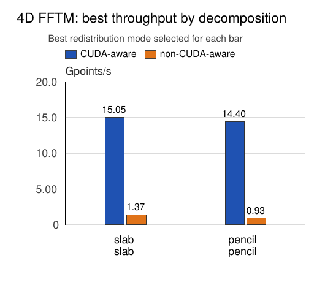](figures/fig_fftm_4d_best_throughput.pdf)

PDF: [`figures/fig_fftm_4d_best_throughput.pdf`](figures/fig_fftm_4d_best_throughput.pdf)

### fftm relative to ffts

[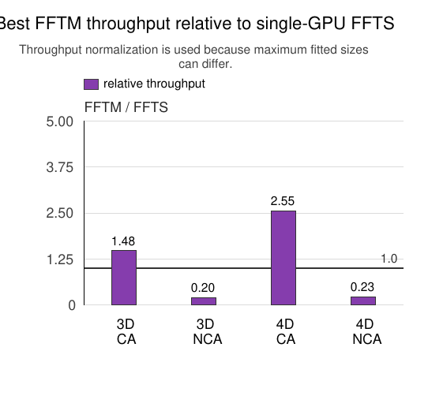](figures/fig_fftm_relative_to_ffts.pdf)

PDF: [`figures/fig_fftm_relative_to_ffts.pdf`](figures/fig_fftm_relative_to_ffts.pdf)

### cuda aware vs nca speedup

[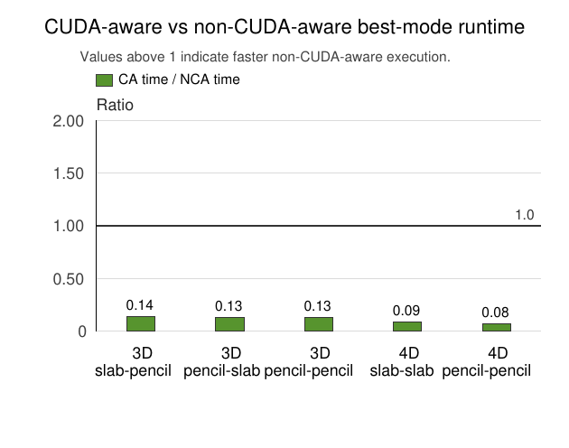](figures/fig_cuda_aware_vs_nca_speedup.pdf)

PDF: [`figures/fig_cuda_aware_vs_nca_speedup.pdf`](figures/fig_cuda_aware_vs_nca_speedup.pdf)

### fftm 3d mode time

[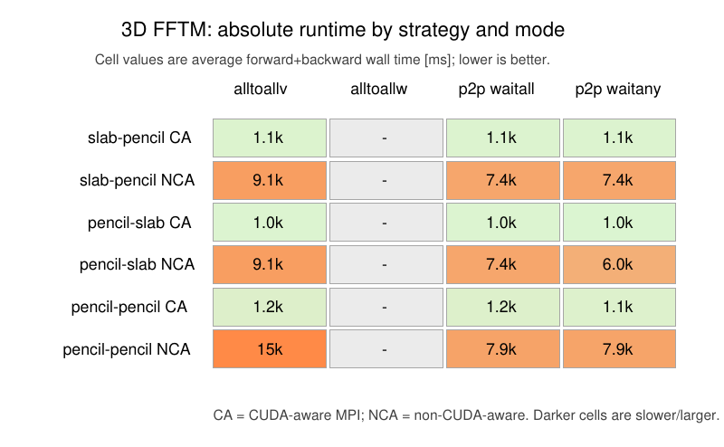](figures/fig_fftm_3d_mode_time.pdf)

PDF: [`figures/fig_fftm_3d_mode_time.pdf`](figures/fig_fftm_3d_mode_time.pdf)

### fftm 3d mode relative

[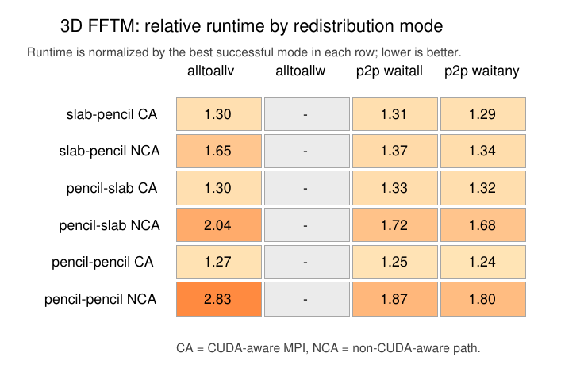](figures/fig_fftm_3d_mode_relative.pdf)

PDF: [`figures/fig_fftm_3d_mode_relative.pdf`](figures/fig_fftm_3d_mode_relative.pdf)

### fftm 3d mode memory

[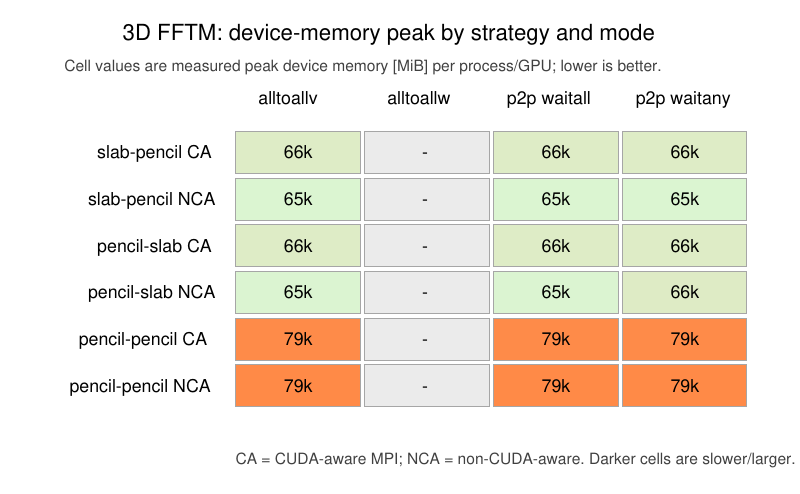](figures/fig_fftm_3d_mode_memory.pdf)

PDF: [`figures/fig_fftm_3d_mode_memory.pdf`](figures/fig_fftm_3d_mode_memory.pdf)

### fftm 4d mode time

[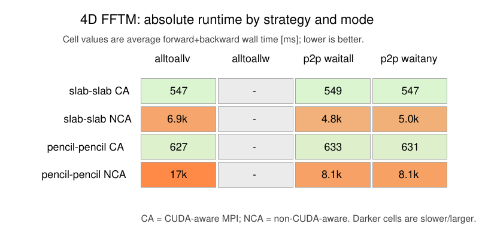](figures/fig_fftm_4d_mode_time.pdf)

PDF: [`figures/fig_fftm_4d_mode_time.pdf`](figures/fig_fftm_4d_mode_time.pdf)

### fftm 4d mode relative

[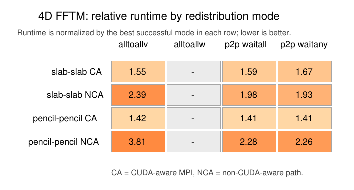](figures/fig_fftm_4d_mode_relative.pdf)

PDF: [`figures/fig_fftm_4d_mode_relative.pdf`](figures/fig_fftm_4d_mode_relative.pdf)

### fftm 4d mode memory

[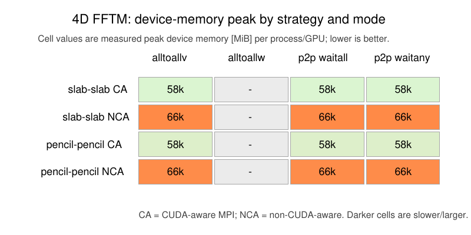](figures/fig_fftm_4d_mode_memory.pdf)

PDF: [`figures/fig_fftm_4d_mode_memory.pdf`](figures/fig_fftm_4d_mode_memory.pdf)

### 3d temporal breakdown vs size

[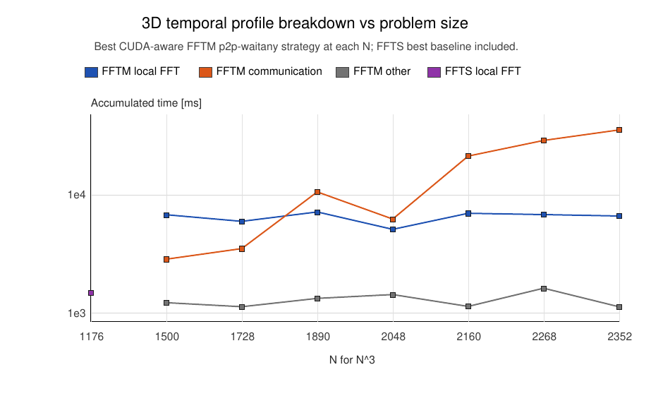](figures/fig_3d_temporal_breakdown_vs_size.pdf)

PDF: [`figures/fig_3d_temporal_breakdown_vs_size.pdf`](figures/fig_3d_temporal_breakdown_vs_size.pdf)

### 3d temporal forward backward vs size

[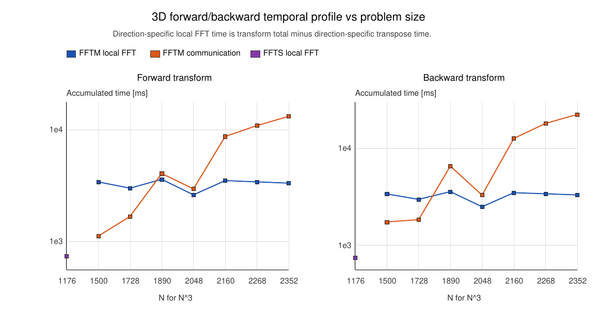](figures/fig_3d_temporal_forward_backward_vs_size.pdf)

PDF: [`figures/fig_3d_temporal_forward_backward_vs_size.pdf`](figures/fig_3d_temporal_forward_backward_vs_size.pdf)

### 4d temporal breakdown vs size

[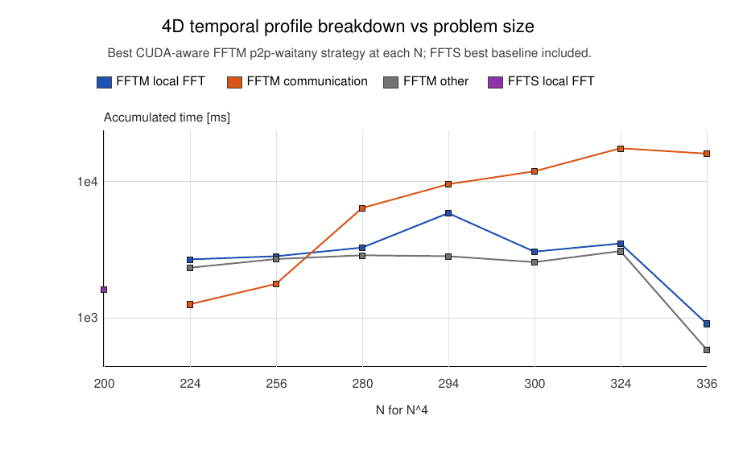](figures/fig_4d_temporal_breakdown_vs_size.pdf)

PDF: [`figures/fig_4d_temporal_breakdown_vs_size.pdf`](figures/fig_4d_temporal_breakdown_vs_size.pdf)

### 4d temporal forward backward vs size

[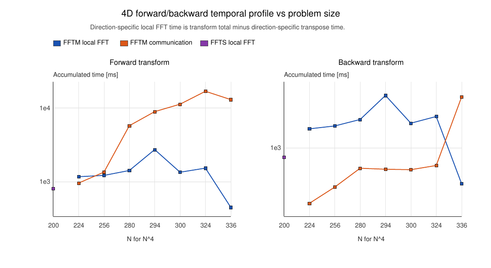](figures/fig_4d_temporal_forward_backward_vs_size.pdf)

PDF: [`figures/fig_4d_temporal_forward_backward_vs_size.pdf`](figures/fig_4d_temporal_forward_backward_vs_size.pdf)

### memory footprint

[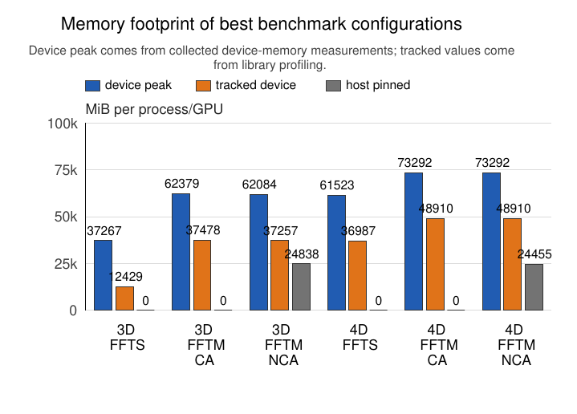](figures/fig_memory_footprint.pdf)

PDF: [`figures/fig_memory_footprint.pdf`](figures/fig_memory_footprint.pdf)

### 3d memory breakdown vs size

[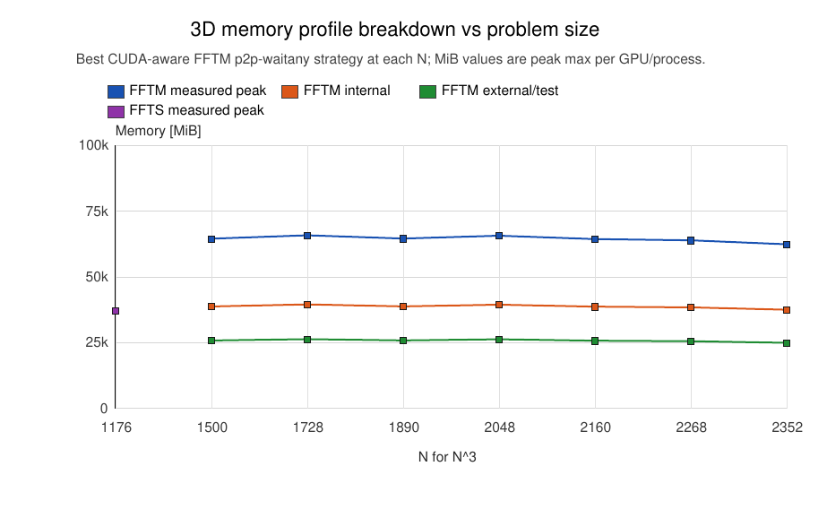](figures/fig_3d_memory_breakdown_vs_size.pdf)

PDF: [`figures/fig_3d_memory_breakdown_vs_size.pdf`](figures/fig_3d_memory_breakdown_vs_size.pdf)

### 3d memory components by strategy

[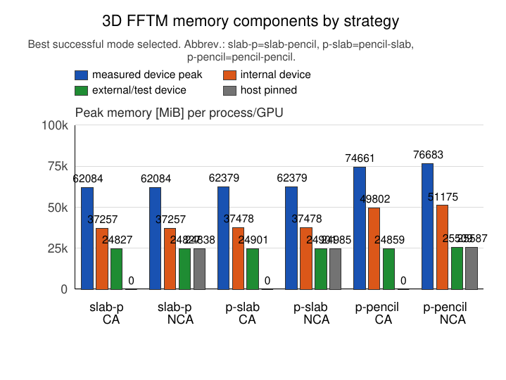](figures/fig_3d_memory_components_by_strategy.pdf)

PDF: [`figures/fig_3d_memory_components_by_strategy.pdf`](figures/fig_3d_memory_components_by_strategy.pdf)

### 4d memory breakdown vs size

[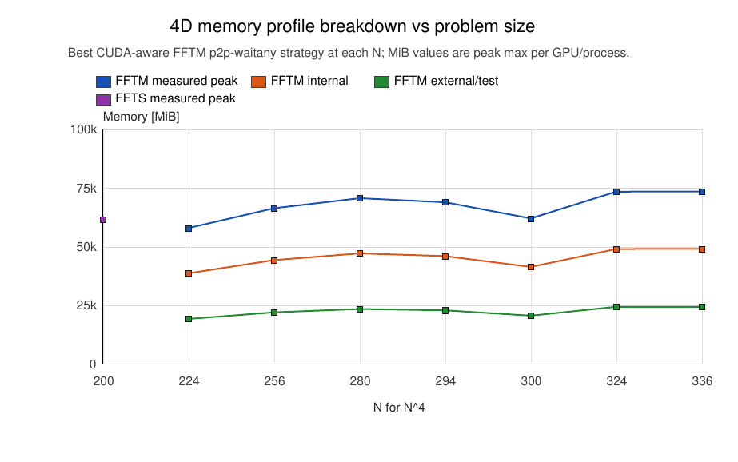](figures/fig_4d_memory_breakdown_vs_size.pdf)

PDF: [`figures/fig_4d_memory_breakdown_vs_size.pdf`](figures/fig_4d_memory_breakdown_vs_size.pdf)

### 4d memory components by strategy

[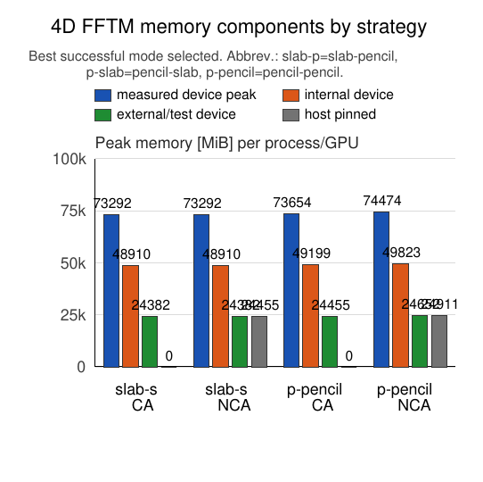](figures/fig_4d_memory_components_by_strategy.pdf)

PDF: [`figures/fig_4d_memory_components_by_strategy.pdf`](figures/fig_4d_memory_components_by_strategy.pdf)

## Tables

- [`table_best_configs.tex`](tables/table_best_configs.tex) / [PDF](tables/table_best_configs.pdf)
- [`table_correctness.tex`](tables/table_correctness.tex) / [PDF](tables/table_correctness.pdf)
- [`table_failures.tex`](tables/table_failures.tex) / [PDF](tables/table_failures.pdf)
- [`table_memory_profile_breakdown.tex`](tables/table_memory_profile_breakdown.tex) / [PDF](tables/table_memory_profile_breakdown.pdf)
- [`table_mode_transport.tex`](tables/table_mode_transport.tex) / [PDF](tables/table_mode_transport.pdf)
- [`table_overview.tex`](tables/table_overview.tex) / [PDF](tables/table_overview.pdf)
- [`table_temporal_profile_breakdown.tex`](tables/table_temporal_profile_breakdown.tex) / [PDF](tables/table_temporal_profile_breakdown.pdf)
