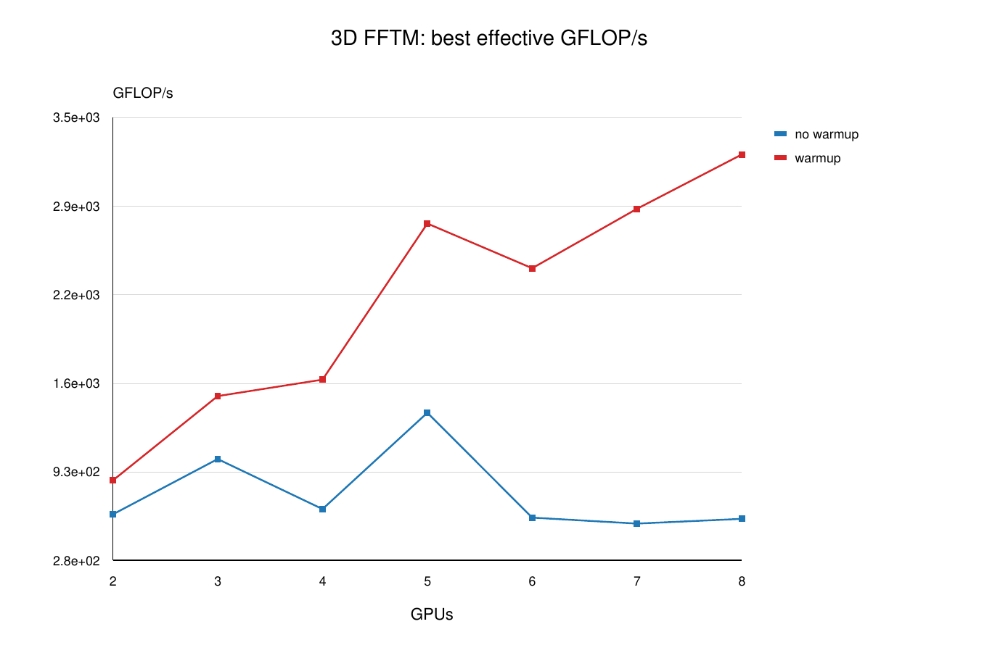
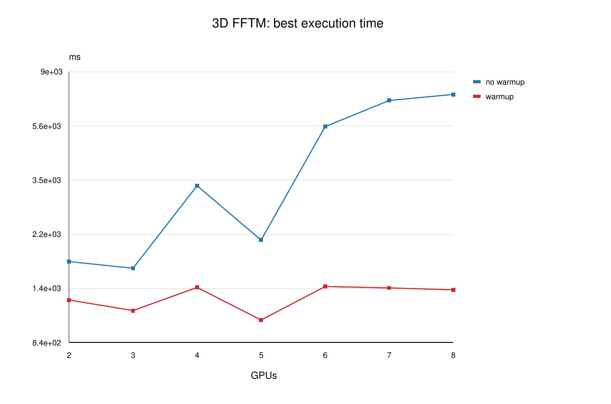
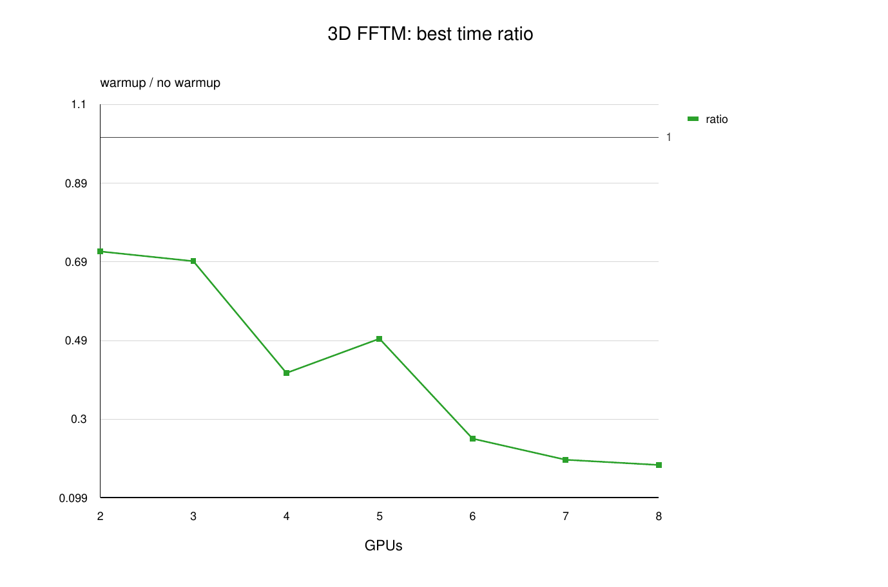
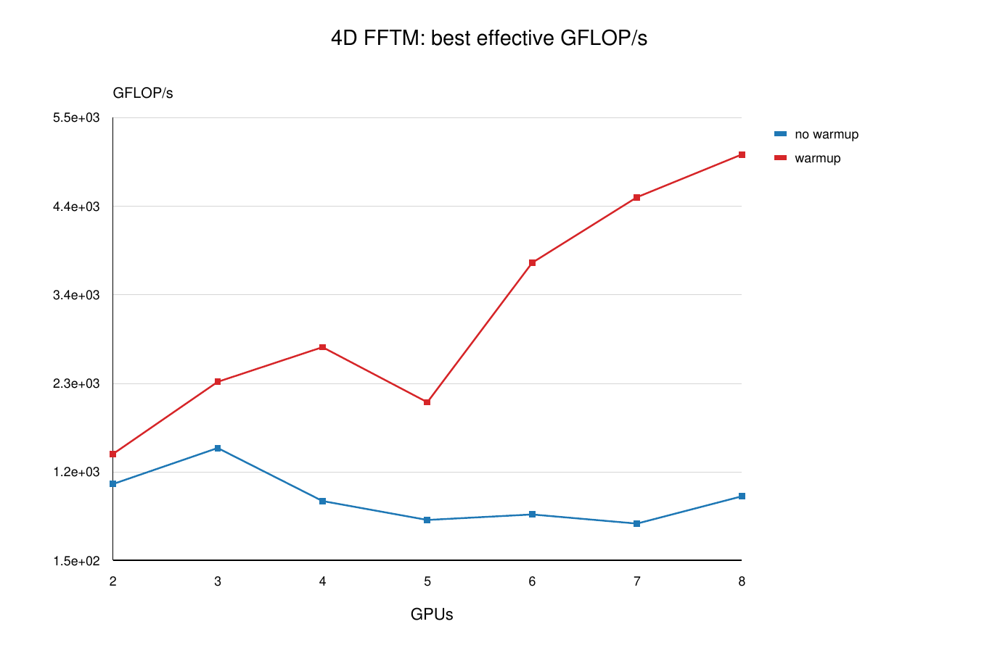
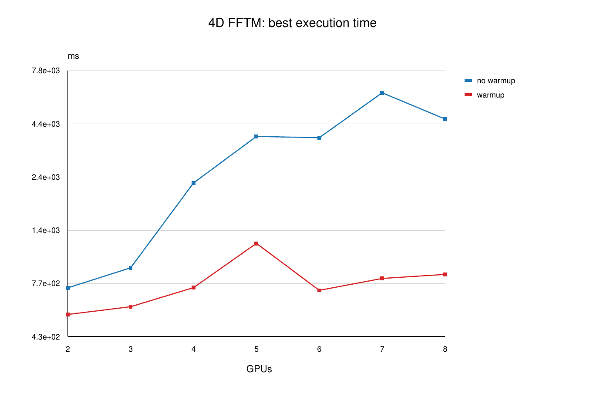
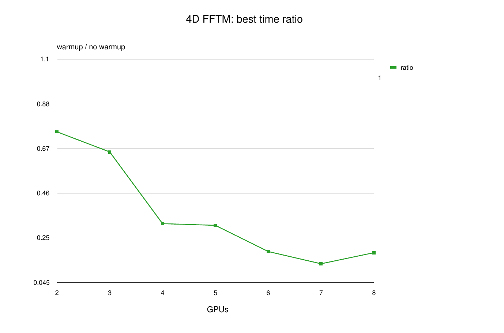
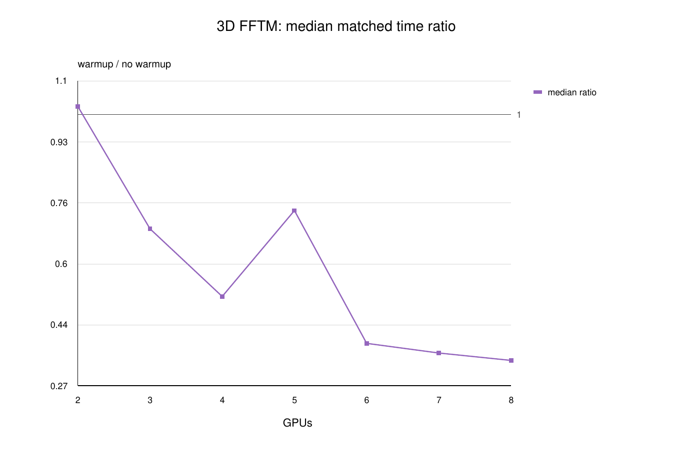
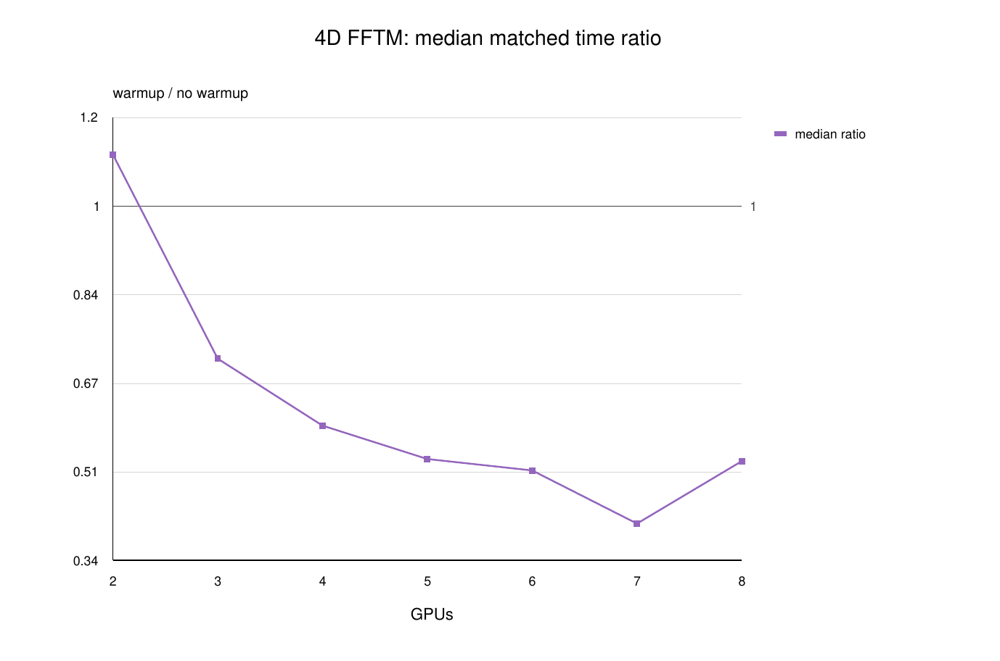

# Warmup Comparison

Comparison between the original `A100_single_node` data and `A100_single_node_warmup`.

Matched successful configurations: 215

## Best FFTM Configurations By GPU Count

| Dim | GPUs | Size | no warmup ms | warmup ms | warmup/no warmup | no warmup GFLOP/s | warmup GFLOP/s |
|---:|---:|---|---:|---:|---:|---:|---:|
| 3 | 2 | 1500x1500x1500 | 1716.6 | 1226.4 | 0.7144 | 622.3 | 871.08 |
| 3 | 3 | 1728x1728x1728 | 1619.8 | 1117.8 | 0.6901 | 1027.8 | 1489.3 |
| 3 | 4 | 1890x1890x1890 | 3334.9 | 1369.3 | 0.4106 | 661.02 | 1610 |
| 3 | 5 | 2048x2048x2048 | 2073.7 | 1029.1 | 0.4963 | 1366.9 | 2754.5 |
| 3 | 6 | 2160x2160x2160 | 5597.1 | 1380 | 0.2465 | 598.32 | 2426.8 |
| 3 | 7 | 2268x2268x2268 | 7035.2 | 1363 | 0.1937 | 554.55 | 2862.4 |
| 3 | 8 | 2352x2352x2352 | 7419.4 | 1340.7 | 0.1807 | 589.21 | 3260.6 |
| 4 | 2 | 224x224x224x224 | 731.08 | 546.88 | 0.748 | 1075.4 | 1437.7 |
| 4 | 3 | 256x256x256x256 | 909.89 | 595.14 | 0.6541 | 1510.5 | 2309.3 |
| 4 | 4 | 280x280x280x280 | 2295.4 | 732.76 | 0.3192 | 870.74 | 2727.6 |
| 4 | 5 | 294x294x294x294 | 3815.2 | 1187.8 | 0.3113 | 642.28 | 2063 |
| 4 | 6 | 300x300x300x300 | 3762.6 | 711.66 | 0.1891 | 708.58 | 3746.4 |
| 4 | 7 | 324x324x324x324 | 6142 | 810.2 | 0.1319 | 598.53 | 4537.4 |
| 4 | 8 | 336x336x336x336 | 4612.5 | 846.73 | 0.1836 | 927.61 | 5053.1 |

## Matched-Configuration Summary

| Dim | GPUs | matched configs | median warmup/no warmup | min | max |
|---:|---:|---:|---:|---:|---:|
| 3 | 2 | 18 | 1.022 | 0.6165 | 1.887 |
| 3 | 3 | 18 | 0.6931 | 0.5511 | 1.403 |
| 3 | 4 | 18 | 0.5116 | 0.2732 | 0.8727 |
| 3 | 5 | 18 | 0.7421 | 0.3208 | 1.505 |
| 3 | 6 | 18 | 0.3857 | 0.1593 | 0.8829 |
| 3 | 7 | 18 | 0.3598 | 0.1284 | 0.8846 |
| 3 | 8 | 18 | 0.34 | 0.1005 | 0.9098 |
| 4 | 2 | 12 | 1.096 | 0.641 | 2.051 |
| 4 | 3 | 12 | 0.717 | 0.454 | 0.9012 |
| 4 | 4 | 12 | 0.5925 | 0.2529 | 0.9584 |
| 4 | 5 | 12 | 0.5305 | 0.2551 | 1.686 |
| 4 | 6 | 12 | 0.5093 | 0.1544 | 0.877 |
| 4 | 7 | 12 | 0.4105 | 0.09416 | 0.8835 |
| 4 | 8 | 12 | 0.5265 | 0.09844 | 0.9296 |

## Figures

### warmup vs base 3d best gflops

PDF: [`figures/fig_warmup_vs_base_3d_best_gflops.pdf`](figures/fig_warmup_vs_base_3d_best_gflops.pdf)

### warmup vs base 3d best time

PDF: [`figures/fig_warmup_vs_base_3d_best_time.pdf`](figures/fig_warmup_vs_base_3d_best_time.pdf)

### warmup vs base 3d best time ratio

PDF: [`figures/fig_warmup_vs_base_3d_best_time_ratio.pdf`](figures/fig_warmup_vs_base_3d_best_time_ratio.pdf)

### warmup vs base 4d best gflops

PDF: [`figures/fig_warmup_vs_base_4d_best_gflops.pdf`](figures/fig_warmup_vs_base_4d_best_gflops.pdf)

### warmup vs base 4d best time

PDF: [`figures/fig_warmup_vs_base_4d_best_time.pdf`](figures/fig_warmup_vs_base_4d_best_time.pdf)

### warmup vs base 4d best time ratio

PDF: [`figures/fig_warmup_vs_base_4d_best_time_ratio.pdf`](figures/fig_warmup_vs_base_4d_best_time_ratio.pdf)

### warmup vs base 3d median matched time ratio

PDF: [`figures/fig_warmup_vs_base_3d_median_matched_time_ratio.pdf`](figures/fig_warmup_vs_base_3d_median_matched_time_ratio.pdf)

### warmup vs base 4d median matched time ratio

PDF: [`figures/fig_warmup_vs_base_4d_median_matched_time_ratio.pdf`](figures/fig_warmup_vs_base_4d_median_matched_time_ratio.pdf)

