# FFTM Benchmark Figures: Local V100x2 Run

This report summarizes the generated benchmark figures for the local two-GPU V100 dataset. 

## Dataset
- GPU count: `2`
- GPU model(s): `Tesla V100-SXM2-32GB`
- GPU memory [MiB]: `32768`
- Generated figures: `21`
- Generated tables: `7`


## Runtime overview

### 3D FFTM/FFTS absolute and relative runtime

[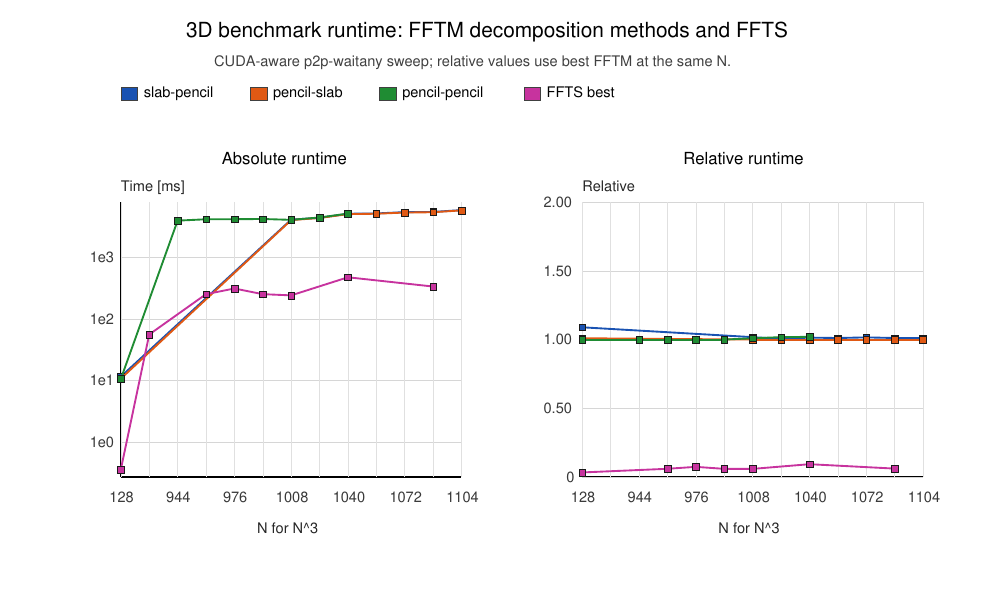](figures/fig_3d_fftm_ffts_absolute_relative_runtime.pdf)

Compares distributed FFTM decomposition methods with the single-GPU FFTS baseline over the collected size sweep.

PDF: [`figures/fig_3d_fftm_ffts_absolute_relative_runtime.pdf`](figures/fig_3d_fftm_ffts_absolute_relative_runtime.pdf)

### 4D FFTM/FFTS absolute and relative runtime

[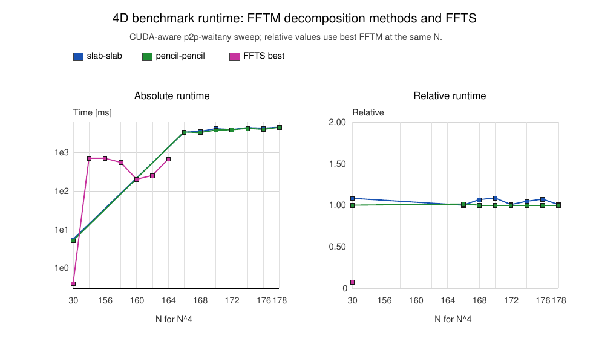](figures/fig_4d_fftm_ffts_absolute_relative_runtime.pdf)

The analogous 4D runtime comparison, including distributed strategies and the FFTS baseline.

PDF: [`figures/fig_4d_fftm_ffts_absolute_relative_runtime.pdf`](figures/fig_4d_fftm_ffts_absolute_relative_runtime.pdf)

## Best throughput and transport comparison

### 3D FFTM best throughput by decomposition

[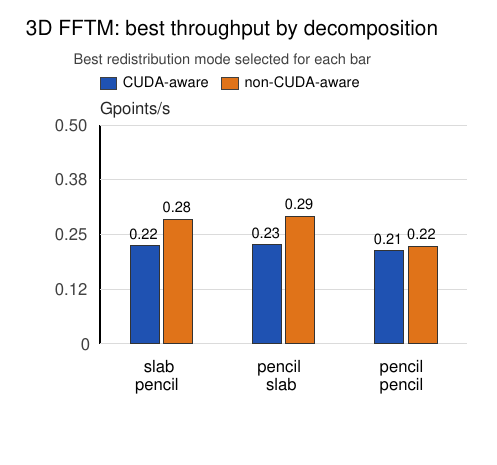](figures/fig_fftm_3d_best_throughput.pdf)

Best redistribution mode selected for each 3D decomposition and transport path.

PDF: [`figures/fig_fftm_3d_best_throughput.pdf`](figures/fig_fftm_3d_best_throughput.pdf)

### 4D FFTM best throughput by decomposition

[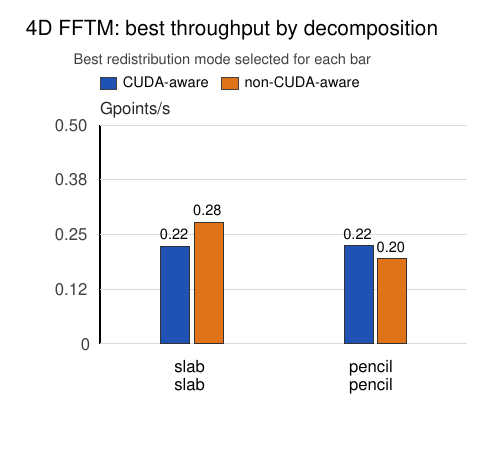](figures/fig_fftm_4d_best_throughput.pdf)

Best redistribution mode selected for each 4D decomposition and transport path.

PDF: [`figures/fig_fftm_4d_best_throughput.pdf`](figures/fig_fftm_4d_best_throughput.pdf)

### Best FFTM throughput relative to FFTS

[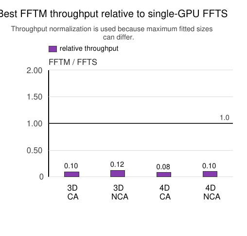](figures/fig_fftm_relative_to_ffts.pdf)

Throughput ratio against the single-GPU FFTS baseline.

PDF: [`figures/fig_fftm_relative_to_ffts.pdf`](figures/fig_fftm_relative_to_ffts.pdf)

### CUDA-aware vs non-CUDA-aware transport

[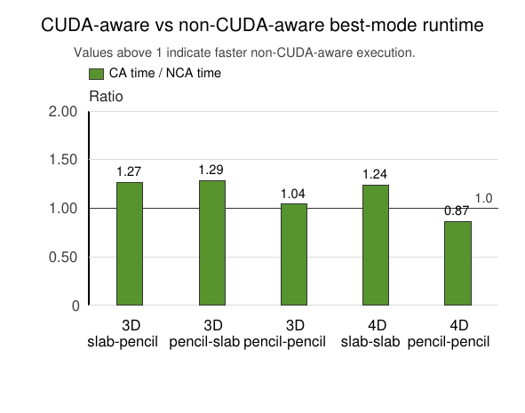](figures/fig_cuda_aware_vs_nca_speedup.pdf)

Ratio of best CUDA-aware runtime to best non-CUDA-aware runtime; values above one indicate the host-staged path was faster.

PDF: [`figures/fig_cuda_aware_vs_nca_speedup.pdf`](figures/fig_cuda_aware_vs_nca_speedup.pdf)

## Strategy and mode breakdown

### 3D absolute runtime by strategy and mode

[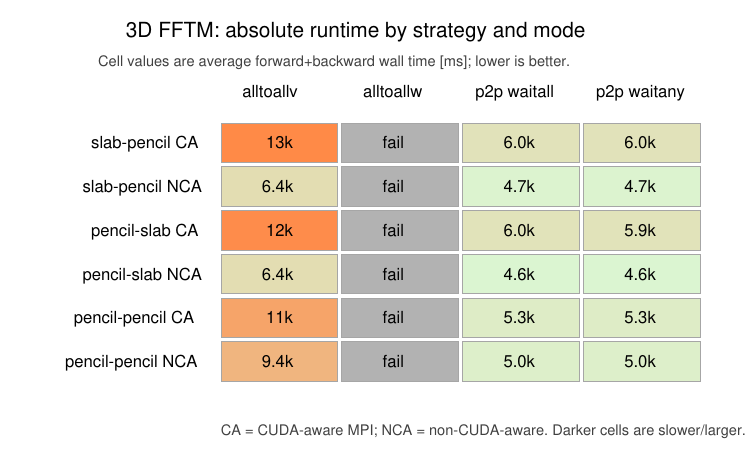](figures/fig_fftm_3d_mode_time.pdf)

Average forward+backward wall time for each 3D strategy/mode/transport combination.

PDF: [`figures/fig_fftm_3d_mode_time.pdf`](figures/fig_fftm_3d_mode_time.pdf)

### 3D relative runtime by strategy and mode

[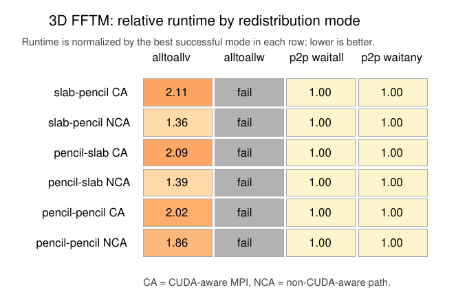](figures/fig_fftm_3d_mode_relative.pdf)

Runtime normalized by the best successful mode in each 3D strategy/transport row.

PDF: [`figures/fig_fftm_3d_mode_relative.pdf`](figures/fig_fftm_3d_mode_relative.pdf)

### 3D device-memory peak by strategy and mode

[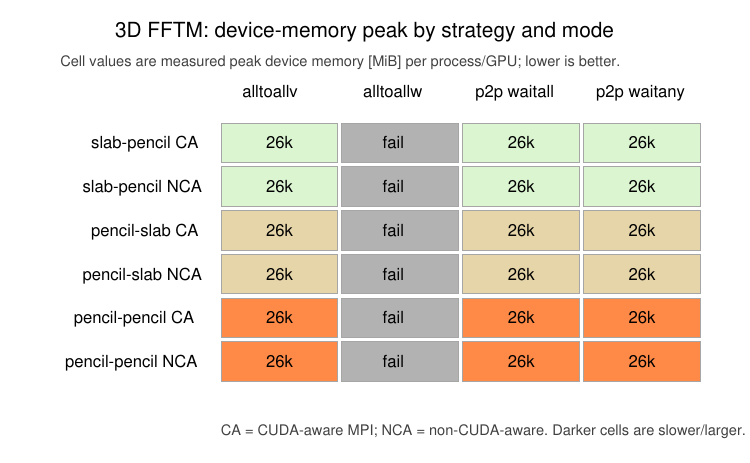](figures/fig_fftm_3d_mode_memory.pdf)

Measured peak device memory for each 3D strategy/mode/transport combination.

PDF: [`figures/fig_fftm_3d_mode_memory.pdf`](figures/fig_fftm_3d_mode_memory.pdf)

### 4D absolute runtime by strategy and mode

[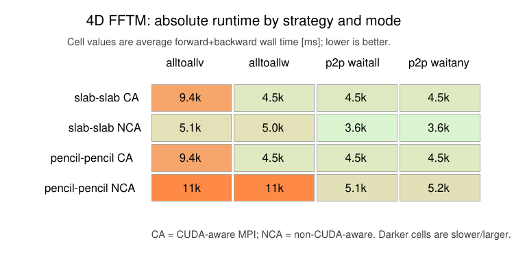](figures/fig_fftm_4d_mode_time.pdf)

Average forward+backward wall time for each 4D strategy/mode/transport combination.

PDF: [`figures/fig_fftm_4d_mode_time.pdf`](figures/fig_fftm_4d_mode_time.pdf)

### 4D relative runtime by strategy and mode

[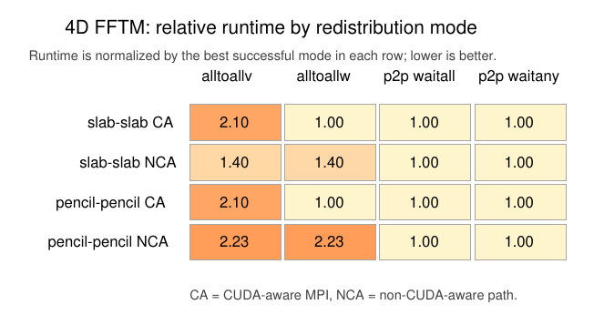](figures/fig_fftm_4d_mode_relative.pdf)

Runtime normalized by the best successful mode in each 4D strategy/transport row.

PDF: [`figures/fig_fftm_4d_mode_relative.pdf`](figures/fig_fftm_4d_mode_relative.pdf)

### 4D device-memory peak by strategy and mode

[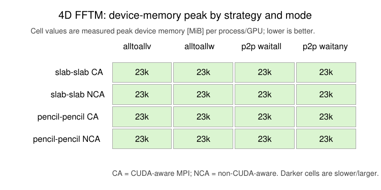](figures/fig_fftm_4d_mode_memory.pdf)

Measured peak device memory for each 4D strategy/mode/transport combination.

PDF: [`figures/fig_fftm_4d_mode_memory.pdf`](figures/fig_fftm_4d_mode_memory.pdf)

## Temporal profiler breakdown

### 3D temporal breakdown vs problem size

[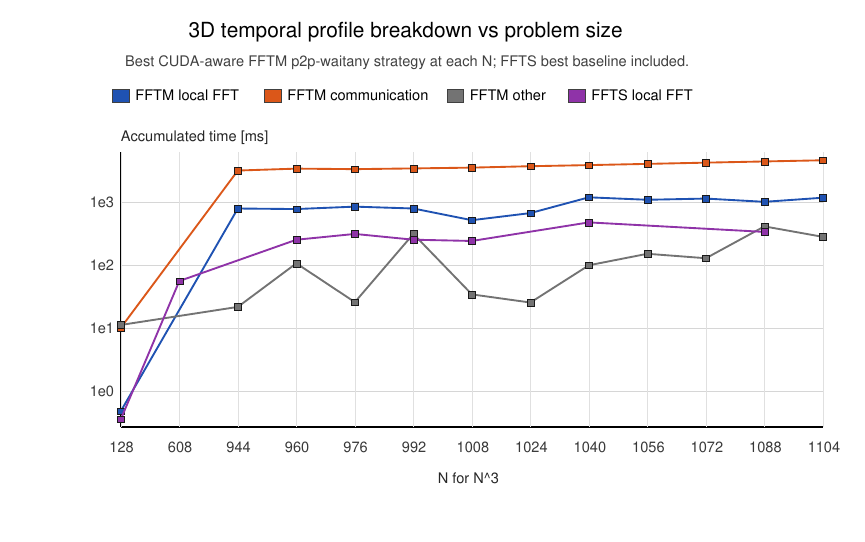](figures/fig_3d_temporal_breakdown_vs_size.pdf)

Separates local FFT time, communication/transposition time, and remaining profiled overhead.

PDF: [`figures/fig_3d_temporal_breakdown_vs_size.pdf`](figures/fig_3d_temporal_breakdown_vs_size.pdf)

### 3D forward/backward temporal breakdown

[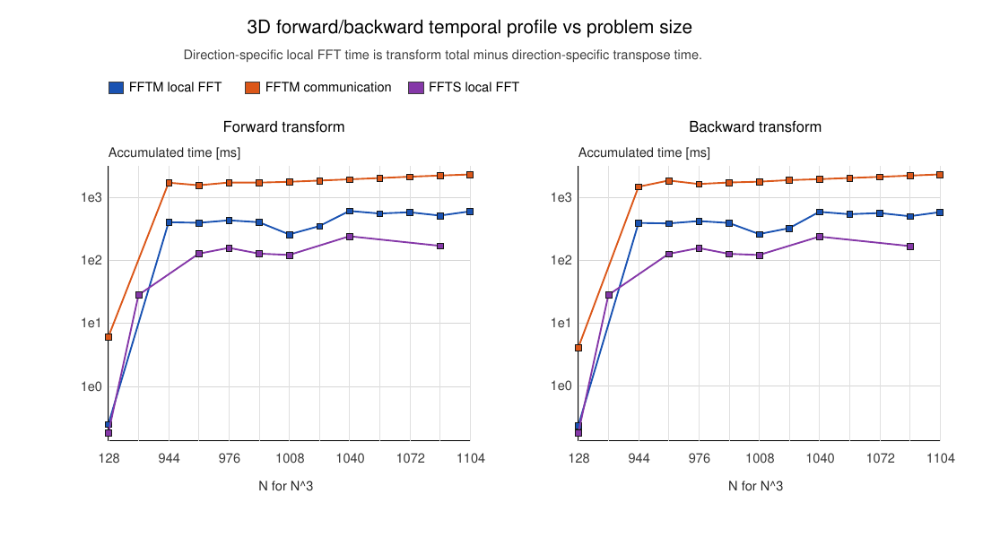](figures/fig_3d_temporal_forward_backward_vs_size.pdf)

Direction-specific split between local FFT work and communication for forward and inverse transforms.

PDF: [`figures/fig_3d_temporal_forward_backward_vs_size.pdf`](figures/fig_3d_temporal_forward_backward_vs_size.pdf)

### 4D temporal breakdown vs problem size

[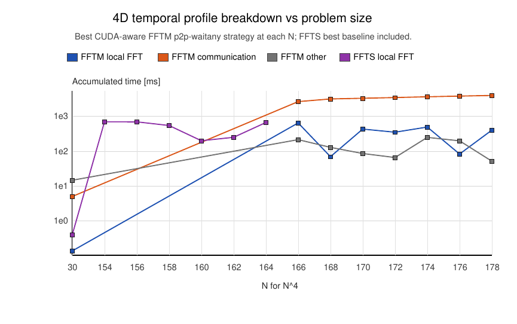](figures/fig_4d_temporal_breakdown_vs_size.pdf)

The same temporal decomposition for 4D transforms.

PDF: [`figures/fig_4d_temporal_breakdown_vs_size.pdf`](figures/fig_4d_temporal_breakdown_vs_size.pdf)

### 4D forward/backward temporal breakdown

[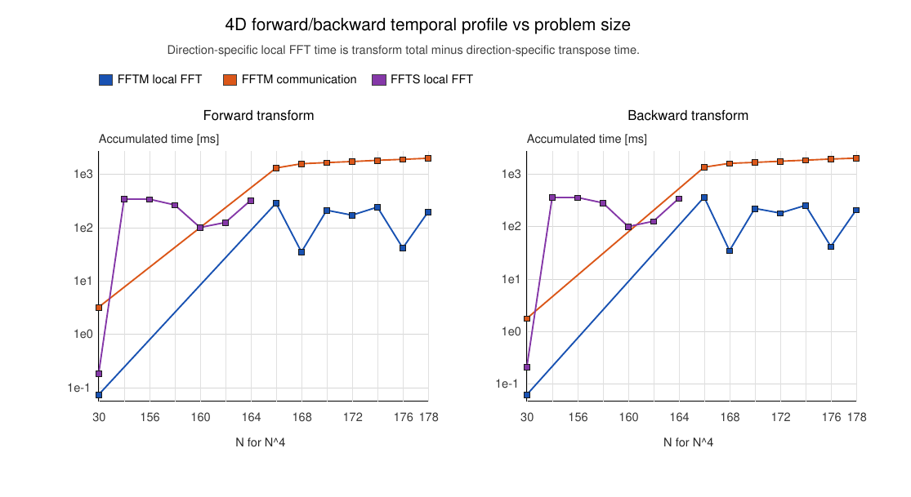](figures/fig_4d_temporal_forward_backward_vs_size.pdf)

Direction-specific 4D split between local FFT work and communication.

PDF: [`figures/fig_4d_temporal_forward_backward_vs_size.pdf`](figures/fig_4d_temporal_forward_backward_vs_size.pdf)

## Memory profiler breakdown

### Overall best-configuration memory footprint

[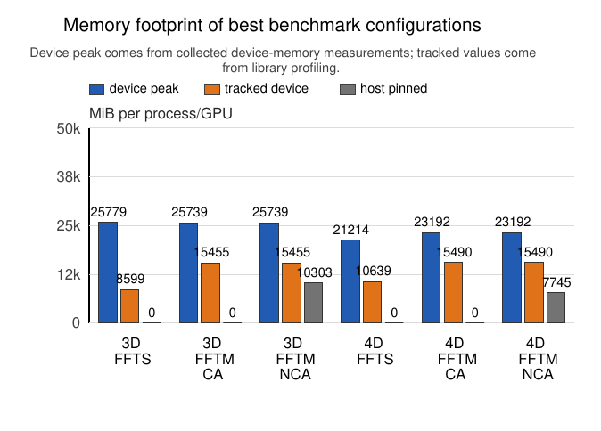](figures/fig_memory_footprint.pdf)

External device-memory measurements together with tracked internal and host-pinned allocations.

PDF: [`figures/fig_memory_footprint.pdf`](figures/fig_memory_footprint.pdf)

### 3D memory breakdown vs problem size

[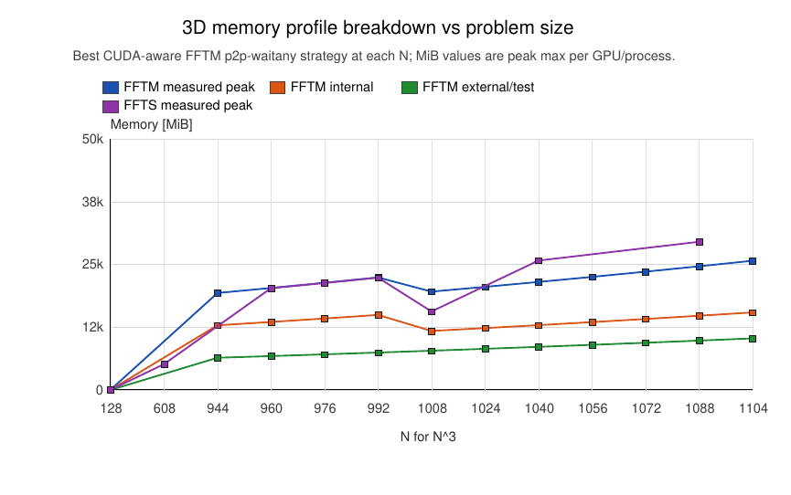](figures/fig_3d_memory_breakdown_vs_size.pdf)

Measured and profiler-tracked memory components as a function of 3D problem size.

PDF: [`figures/fig_3d_memory_breakdown_vs_size.pdf`](figures/fig_3d_memory_breakdown_vs_size.pdf)

### 3D memory components by strategy

[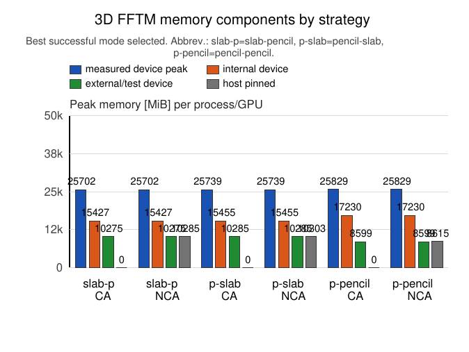](figures/fig_3d_memory_components_by_strategy.pdf)

Best successful mode selected per 3D strategy/transport, with component-level memory categories.

PDF: [`figures/fig_3d_memory_components_by_strategy.pdf`](figures/fig_3d_memory_components_by_strategy.pdf)

### 4D memory breakdown vs problem size

[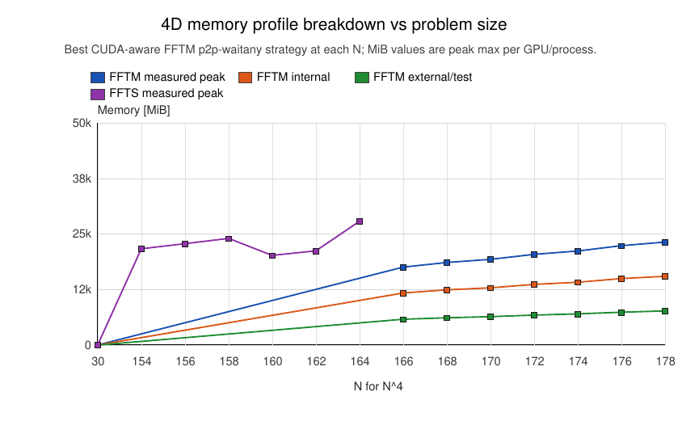](figures/fig_4d_memory_breakdown_vs_size.pdf)

Measured and profiler-tracked memory components as a function of 4D problem size.

PDF: [`figures/fig_4d_memory_breakdown_vs_size.pdf`](figures/fig_4d_memory_breakdown_vs_size.pdf)

### 4D memory components by strategy

[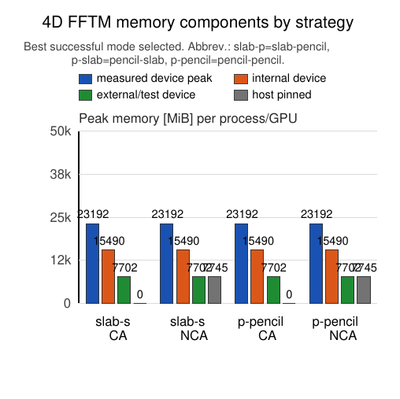](figures/fig_4d_memory_components_by_strategy.pdf)

Best successful mode selected per 4D strategy/transport, with component-level memory categories.

PDF: [`figures/fig_4d_memory_components_by_strategy.pdf`](figures/fig_4d_memory_components_by_strategy.pdf)

## Tables

- Benchmark data overview: [`tables/table_overview.pdf`](tables/table_overview.pdf), [`tables/table_overview.tex`](tables/table_overview.tex)
- Best benchmark configurations: [`tables/table_best_configs.pdf`](tables/table_best_configs.pdf), [`tables/table_best_configs.tex`](tables/table_best_configs.tex)
- Best FFTM mode by strategy and transport: [`tables/table_mode_transport.pdf`](tables/table_mode_transport.pdf), [`tables/table_mode_transport.tex`](tables/table_mode_transport.tex)
- Versioned test correctness summary: [`tables/table_correctness.pdf`](tables/table_correctness.pdf), [`tables/table_correctness.tex`](tables/table_correctness.tex)
- Failed measurement summary: [`tables/table_failures.pdf`](tables/table_failures.pdf), [`tables/table_failures.tex`](tables/table_failures.tex)
- Temporal profiler breakdown: [`tables/table_temporal_profile_breakdown.pdf`](tables/table_temporal_profile_breakdown.pdf), [`tables/table_temporal_profile_breakdown.tex`](tables/table_temporal_profile_breakdown.tex)
- Memory profiler breakdown: [`tables/table_memory_profile_breakdown.pdf`](tables/table_memory_profile_breakdown.pdf), [`tables/table_memory_profile_breakdown.tex`](tables/table_memory_profile_breakdown.tex)

## Regeneration

```bash
python3 scripts/analyze_paper_results.py --data-directory build/paper_data/local_v100x2
```
